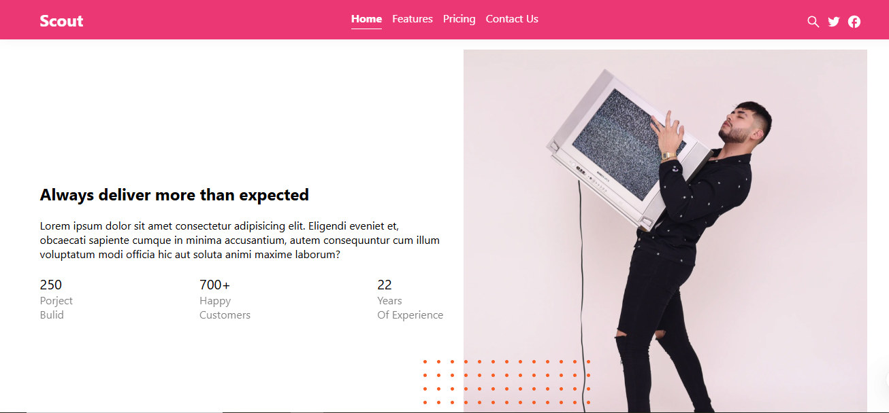

    
    
  ## 🌐 Project Overview 

This project is a high-performance web application built using Next.js, a React-based framework that enables server-side rendering, static site generation, and seamless routing. Designed with scalability and user experience in mind, the site delivers fast load times, optimized SEO, and a responsive interface across all devices.

  ## 🚀 Features :

- Next.js Framework – Powerful hybrid rendering (SSR & SSG)

- Dynamic Routing – Intuitive page-based routing system

- API Routes – Built-in backend functionality without external servers

- Optimized Performance – Automatic code splitting and image optimization

- Responsive Design – Mobile-first layout with modern UI components

- SEO Friendly – Meta tags and structured data for better search visibility

    ## 🛠️ Tech Stack: 
- Frontend: React, Next.js

- Styling: Tailwind CSS / Styled Components

- Deployment: Vercel / Netlify / Custom Server

- Optional: TypeScript, ESLint, Prettier for code quality

    ## 📄 License
This project is licensed under the MIT License.
